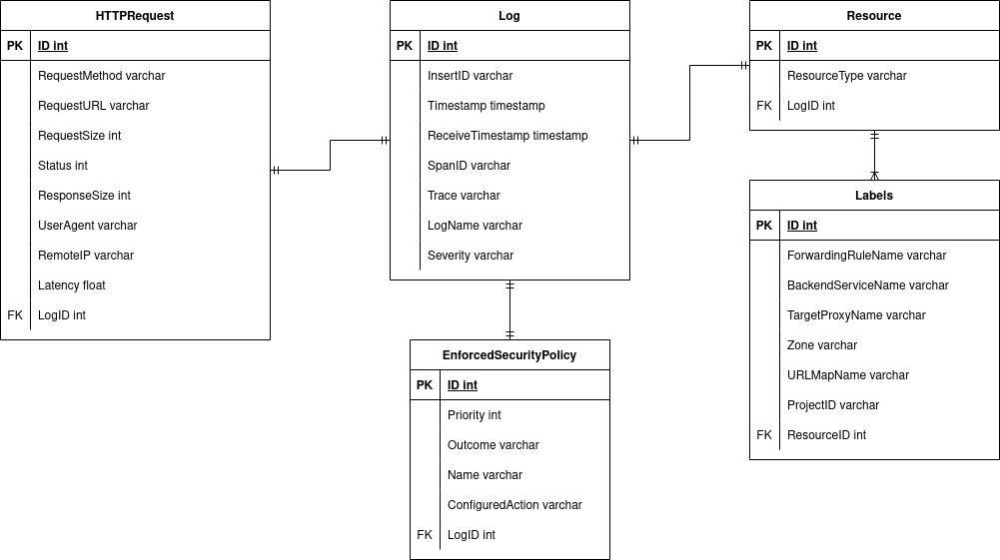

### 1. Realice un modelo entidad relación normalizado de la siguiente información de logs almacenada por un balanceador de carga en la plataforma GCP: (60 pts)

### 2. Asumiendo que el sistema manejara millones de registros como el de la pregunta anterior y que la información mas importante es la más reciente, ¿Qué motor de bases de datos NoSQL recomendaría utilizar? Explique en detalle. (40 pts)

Las primeras opciones en muchos ejemplos son mongodb y elasticsearch, pero estas, a pesar de que pueden manejar millones de datos, tienen problemas a la hora de escalar los datos. Una de las más grandes ventajas de MongoDB es la flexibilidad para guardar datos, pero como este log tiene una estructura fija, esto se desperdicia. Elasticsearch, por otro lado, puede llegar a ser muy caro como base de datos principal por como funciona el indexado de esta. Por ende, la base de datos que escojo para la respuesta es Apache Cassandra, la cual puede manejar grandes volúmenes de datos distribuidos en muchos nodos y, gracias a esto, está diseñada para tener un rendimiento constante a medida que esta vaya creciendo. Una ventaja adicional de utilizar Cassandra es el soporte de Time To Live en sus datos, lo cual puede ser útil si solo son importantes los datos más recientes.
